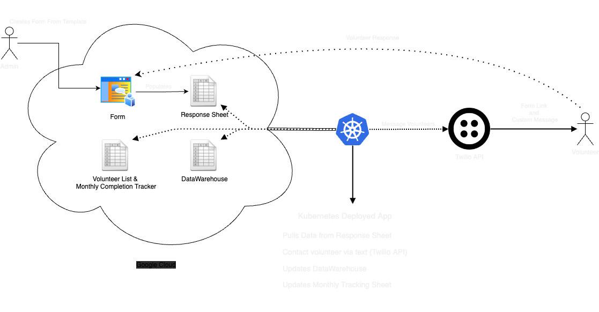

# volunteer-data-collector
Automate collecting volunteer data on a monthly basis. 

<b>Documentation in progress... check back soon for a detailed Readme of this project :)</b>

## Preface
I enjoy doing volunteer work, specifically focusing on encouraging and providing hope to those afflicted by life's challenges.
At the end of every month I am responsible for collecting data from a few other volunteers, and as you can imagine; 
  chasing down each person to have them fill out a slip is a challenging task. 
The idea of automating the collection process was born!
This way, it is easier for me AND the volunteers :)

## Project Info
### APIs/Services Required
- Google Cloud (Sheets, Drive, Forms)
- Twilio
- Kubernetes or Docker
- (Currently deployed on a bare-metal Kubernetes cluster on raspberry pi 4's!)

# Process: 
  - Admin creates a form from existing template
  - Admin links form to response sheet
  - Admin updates tracking sheet with new link and form url
  
  - App will query tracking sheet to find current report month and status
  - App will process response sheet data
  - If any volunteer has not submitted data, text message will be sent by Twilio
  - Once data is fully collected, tracking sheet marks outstanding month as complete
  - When new data is available, App udpates "data warehouse" (Google Sheet)

### Future Project Objectives/Ideas:
- [ ] Create a Web Front End for Admin and user creation
- [ ] Fully automate form creation with new Google Forms API
- [ ] Choose cloud deployment method (AWS/DigitalOcean/Oracle...)
- [ ] Decide on a domain and website name
- [ ] Modify code to use message queuing system from app to Twilio
- [ ] Refactor with the goal of being scalable (for kube/docker)

<b>Diagram</b>

